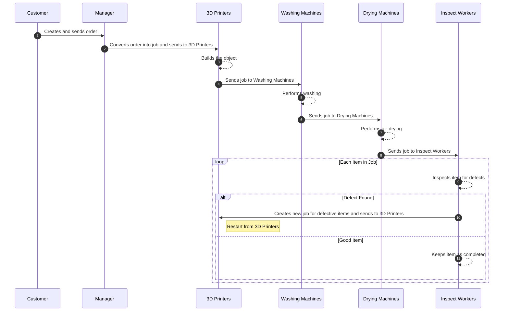

# SimPy based 3D Print Farm

## Operation scenario 

<!-- 
############## AMR을 고려한 경우 ################# 
```mermaid
sequenceDiagram
    participant PS as Pallet Storage
    participant RW as Resin Worker
    participant IW as Inspection Workers
    participant A1 as AMR1 (Pallet Storage ↔ Build)
    participant A2 as AMR2 (Build ↔ Washing)
    participant A3 as AMR3 (Washing ↔ Drying)
    participant A4 as AMR4 (Drying ↔ Support)
    participant P as 3D Printers
    participant WM as Washing Machines
    participant DM as Drying Machines
    participant B as Box
    participant S as System

    %% Process 1: Build Process
    autonumber
    A1->>PS: Picks up empty pallet from Pallet Storage
    A1->>P: Places pallet into 3D Printers (Setup)
    RW->>P: Fills liquid resin into 3D Printers (Setup)
    P-->>P: Builds the object (Build)
    P-->>P: Pallet Lifting (Closing)
    P-->>P: Waits for resin to drip off surface (Closing)

    %% Process 2: Washing Process
    A2->>P: Removes pallet with build part from 3D Printers
    A2->>WM: Places pallet into Washing Machines (Setup)
    WM-->>WM: Performs washing

    %% Process 3: Air-drying Process
    A3->>WM: Removes pallet from Washing Machines
    A3->>DM: Places pallet into Drying Machines (Setup)
    DM-->>DM: Performs air-drying

    %% Process 4: Support Removal Process
    A4->>DM: Removes pallet from Drying Machines
    A4->>IW: Delivers pallet to Inspection Workers (Setup)
    loop Each Item in Pallet
        IW-->>IW: Removes item and removes support (Support Removal)
        IW-->>IW: Inspects item for defects (Inspection)
        alt Defect Found
            IW-->>S: Increases reproduction item count by 1
            Note right of S: When reproduction item count reaches 50
            S->>A1: Restarts Process 1 with a new pallet from Pallet Storage
        else Good Item
            IW->>B: Places item into Box
            alt Box is Full
                B->>S: Sends Box out of the system
            end
        end
    end
``` -->